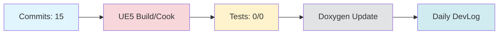

# Daily DevLog — 2025-11-10 (월)

**범위**: 2025-11-09 ~ 2025-11-10
**브랜치**: docs / 베이스: origin/main
**릴리즈 타겟**: N/A

---

## 1. 오늘의 핵심 변경 (Top Changes)

- [chore] chore: 불필요한 파일 삭제 및 워크플로우 수정 — 영향: 유지보수

- [other] Merge branch 'main' of https://github.com/doppleddiggong/Onepiece — 영향: 기타 변경

- [chore] chore: 불필요한 템플릿 및 이미지 파일 제거 — 영향: 유지보수

### Commit Heatmap
- 총 커밋: 15
- 변경 라인: +25586 / -3582
- 영향 파일: Doxyfile.template, Doxyfile, .claude/commands/self-assessment.md, Source/LatteLibrary/Character/Private/ALatteGameCharacter.cpp, Source/LatteLibrary/Character/Public/ALatteGameCharacter.h

---

## 2. 시스템 영향도 (Impact)

### 성능

- 로딩: 데이터 없음

### 안정성

- 크래시: 데이터 없음

### 네트워크

- 네트워크: 데이터 없음

---

## 3. 검증 (Verification)

### 빌드 (UE5)

- 빌드 정보 없음

### 테스트

- 테스트 결과 없음

### 정적분석

- 정적분석 결과 없음

---

## 4. 코드 문서화 변화 (Doxygen Delta)

- API 변화 없음

---

## 5. 리팩토링·위험 이슈

### 리팩토링

- 리팩토링 없음

### 위험

- 위험 항목 없음

---

## 6. 내일(Next)·미진(Action)

### Next

- 계획된 작업 없음

### 미진

- 미진 작업 없음

---

## 7. Mermaid 개요도

---

**생성 시간**: 2025-11-10 14:41:11
---

# 🎓 개발자 성장 피드백 (GPT-4 Analysis)

## 🤔 성찰 질문
- 불필요한 파일을 삭제하는 과정에서, 어떤 기준으로 파일의 필요성을 판단했나요? 이 기준을 어떻게 개선할 수 있을까요?
- 워크플로우 스크립트에서 `--until` 인수를 제거했는데, 이 변경이 다른 부분에 어떤 영향을 미칠 수 있을까요?
- 현재 작업에 대한 테스트 및 빌드가 없었는데, 이를 어떻게 개선할 수 있을까요? 왜 빌드와 테스트가 중요한지 다시 생각해보세요.
- 병합 커밋에서 발생할 수 있는 문제는 무엇이며, 이를 해결하기 위해 어떤 전략을 사용할 수 있을까요?

## 💡 대안 제시
- **테스트 자동화**: 기본적인 테스트를 자동화하여 변화에 대한 안전성을 확보할 수 있습니다. CI/CD 파이프라인에 테스트 단계를 추가해보세요.
- **변경관리**: 대규모 변경 시에는 단계적으로 파일을 삭제하고 작업을 나누는 것이 좋습니다. 이렇게 하면 문제 발생 시 쉽게 원인을 추적할 수 있습니다.
- **빌드 검증**: 매일의 작업 로그에 빌드 상태를 포함하는 것도 좋은 습관입니다. 빌드 상태가 항상 '녹색'인지 확인해보세요.
  
## 📚 학습 포인트
- **Git Merge 전략**: 병합 전략(merge vs rebase)에 대해 학습하고, 상황에 맞는 전략을 선택하는 방법을 익혀보세요.
- **CI/CD 파이프라인 개선**: GitHub Actions 등으로 CI/CD 파이프라인을 개선하고, 워크플로우에서 사용하지 않는 부분을 정리하는 방법을 익혀보세요.
- **정적 분석 도구**: 코드 품질을 유지하기 위해 정적 분석 도구를 활용하는 방법에 대해 더 공부해보세요.

## ⚠️ 주의 사항
- **기술 부채**: 불필요한 파일을 삭제한다고 해서 기술 부채가 줄어드는 것은 아닙니다. 코드의 복잡성을 줄이고, 문서화가 잘 되어 있는지 항상 점검하세요.
- **크래시 및 버그**: 변경 후 테스트가 이루어지지 않았으므로, 예기치 않은 크래시나 버그가 발생할 수 있습니다. 꼭 테스트를 추가하세요.
- **워크플로우 의존성**: 워크플로우 스크립트에서 인수를 제거할 때, 다른 스크립트나 프로세스와의 의존성을 확인해야 합니다.

## 🎯 다음 단계 제안
- **테스트 케이스 작성**: 주요 기능에 대한 테스트 케이스를 작성하여 코드의 안정성을 높이세요.
- **정적 분석 툴 도입**: 코드 품질을 높이기 위해 정적 분석 도구를 프로젝트에 통합해보세요.
- **워크플로우 개선**: CI/CD 파이프라인에 빌드 및 테스트 단계를 추가하여 자동화 수준을 높이세요.
- **코드 리뷰 과정 도입**: 병합 전에 코드 리뷰 과정을 통해 코드 품질을 확보하고, 잠재적인 문제를 미리 식별하세요.

---

*이 피드백은 OpenAI GPT-4를 통해 자동 생성되었습니다. 참고용으로 활용하시고, 최종 판단은 개발자 본인이 내리시기 바랍니다.*
