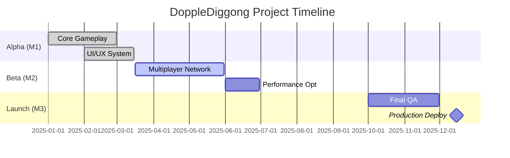

# 간트차트 연동 가이드

**작성일**: 2025-11-11
**버전**: 1.0

---

## 목차

1. [간트차트 개요](#1-간트차트-개요)
2. [데이터 포맷](#2-데이터-포맷)
3. [Git 기반 자동 생성](#3-git-기반-자동-생성)
4. [연동 방식](#4-연동-방식)
5. [사용 예시](#5-사용-예시)

---

## 1. 간트차트 개요

### 1.1 목적

**진행 상황 체크 + 일정 관리 시각화**

- 프로젝트 전체 타임라인 한눈에 파악
- 마일스톤 달성 여부 확인
- 태스크 간 의존성 관리
- 리소스 배분 최적화

### 1.2 구성 요소

- **태스크 (Task)**: 개별 작업 단위
- **마일스톤 (Milestone)**: 주요 목표 지점
- **의존성 (Dependency)**: 태스크 간 선후 관계
- **진행률 (Progress)**: 작업 완료 비율
- **담당자 (Assignee)**: 작업 책임자

---

## 2. 데이터 포맷

### 2.1 YAML 형식

```yaml
# milestones.yaml

project:
  name: "DoppleDiggong Game Project"
  start_date: "2025-01-01"
  end_date: "2025-12-31"

milestones:
  - id: m1
    name: "Alpha Release"
    target_date: "2025-03-31"
    status: "completed"
    progress: 100

  - id: m2
    name: "Beta Release"
    target_date: "2025-06-30"
    status: "in_progress"
    progress: 65

  - id: m3
    name: "Production Launch"
    target_date: "2025-12-15"
    status: "pending"
    progress: 0

tasks:
  - id: t1
    name: "Core Gameplay Implementation"
    milestone: m1
    start_date: "2025-01-01"
    end_date: "2025-02-28"
    assignee: "John Doe"
    status: "completed"
    progress: 100
    priority: "P1"
    dependencies: []

  - id: t2
    name: "UI/UX System Development"
    milestone: m1
    start_date: "2025-02-01"
    end_date: "2025-03-15"
    assignee: "Jane Smith"
    status: "completed"
    progress: 100
    priority: "P1"
    dependencies: [t1]

  - id: t3
    name: "Multiplayer Networking"
    milestone: m2
    start_date: "2025-03-16"
    end_date: "2025-05-31"
    assignee: "John Doe"
    status: "in_progress"
    progress: 70
    priority: "P0"
    dependencies: [t1, t2]

  - id: t4
    name: "Performance Optimization"
    milestone: m2
    start_date: "2025-06-01"
    end_date: "2025-06-30"
    assignee: "Team"
    status: "pending"
    progress: 0
    priority: "P1"
    dependencies: [t3]
```

---

### 2.2 JSON 형식

```json
{
  "project": {
    "name": "DoppleDiggong Game Project",
    "start_date": "2025-01-01",
    "end_date": "2025-12-31"
  },
  "milestones": [
    {
      "id": "m1",
      "name": "Alpha Release",
      "target_date": "2025-03-31",
      "status": "completed",
      "progress": 100
    },
    {
      "id": "m2",
      "name": "Beta Release",
      "target_date": "2025-06-30",
      "status": "in_progress",
      "progress": 65
    }
  ],
  "tasks": [
    {
      "id": "t1",
      "name": "Core Gameplay Implementation",
      "milestone": "m1",
      "start_date": "2025-01-01",
      "end_date": "2025-02-28",
      "assignee": "John Doe",
      "status": "completed",
      "progress": 100,
      "priority": "P1",
      "dependencies": []
    }
  ]
}
```

---

### 2.3 Mermaid 간트차트



---

## 3. Git 기반 자동 생성

### 3.1 Git 태그로 마일스톤 추적

```bash
# 마일스톤을 Git 태그로 관리
git tag -a v1.0-alpha -m "Alpha Release" <commit_sha>
git tag -a v1.0-beta -m "Beta Release" <commit_sha>
git tag -a v1.0 -m "Production Launch" <commit_sha>

# 태그 푸시
git push origin --tags
```

### 3.2 Git Issue로 태스크 관리

```bash
# GitHub Issue 활용
gh issue create --title "Multiplayer Networking" \
  --body "Implement multiplayer sync" \
  --label "P0,milestone:v1.0-beta" \
  --assignee "johndoe"

# Issue 진행 상황 추적
gh issue list --milestone "v1.0-beta" --json number,title,state,assignees
```

### 3.3 커밋 메시지로 진행률 추정

```bash
# 특정 태스크 관련 커밋 추적
git log --all --grep="[t3]" --pretty=format:"%H|%ad|%s"

# 커밋 빈도로 진행률 추정
# 예: 10개 커밋 목표 중 7개 완료 = 70% 진행
```

---

## 4. 연동 방식

### 4.1 Markdown → 간트차트 도구

**Mermaid Live Editor**

1. Markdown 파일에 Mermaid 코드 작성
2. [Mermaid Live](https://mermaid.live/) 방문
3. 코드 붙여넣기 → 시각화
4. Export PNG/SVG

**GitHub Markdown**

- GitHub는 Mermaid를 기본 지원
- `.md` 파일에 Mermaid 코드 작성 시 자동 렌더링

---

### 4.2 YAML/JSON → Excel/Google Sheets

**Python 스크립트 예시**

```python
import yaml
import openpyxl
from datetime import datetime

# YAML 파일 로드
with open('milestones.yaml', 'r') as f:
    data = yaml.safe_load(f)

# Excel 워크북 생성
wb = openpyxl.Workbook()
ws = wb.active
ws.title = "Gantt Chart"

# 헤더 작성
headers = ['Task ID', 'Task Name', 'Start Date', 'End Date', 'Assignee', 'Progress', 'Status']
ws.append(headers)

# 태스크 데이터 작성
for task in data['tasks']:
    row = [
        task['id'],
        task['name'],
        task['start_date'],
        task['end_date'],
        task['assignee'],
        f"{task['progress']}%",
        task['status']
    ]
    ws.append(row)

# 파일 저장
wb.save('gantt_chart.xlsx')
print("✅ Excel 파일 생성 완료: gantt_chart.xlsx")
```

---

### 4.3 Notion 연동

**Notion API 활용**

```python
import requests

NOTION_API_KEY = "your_api_key"
DATABASE_ID = "your_database_id"

headers = {
    "Authorization": f"Bearer {NOTION_API_KEY}",
    "Content-Type": "application/json",
    "Notion-Version": "2022-06-28"
}

# 태스크 생성
for task in data['tasks']:
    payload = {
        "parent": {"database_id": DATABASE_ID},
        "properties": {
            "Name": {"title": [{"text": {"content": task['name']}}]},
            "Start": {"date": {"start": task['start_date']}},
            "End": {"date": {"start": task['end_date']}},
            "Assignee": {"people": [{"name": task['assignee']}]},
            "Progress": {"number": task['progress']},
            "Status": {"select": {"name": task['status']}}
        }
    }

    response = requests.post(
        "https://api.notion.com/v1/pages",
        headers=headers,
        json=payload
    )

    print(f"✅ {task['name']} 생성 완료")
```

---

### 4.4 Jira 연동

**Jira REST API**

```python
from jira import JIRA

jira = JIRA(
    server='https://your-domain.atlassian.net',
    basic_auth=('email', 'api_token')
)

# Epic (마일스톤) 생성
for milestone in data['milestones']:
    epic = jira.create_issue(
        project='PROJ',
        summary=milestone['name'],
        description=f"Target: {milestone['target_date']}",
        issuetype={'name': 'Epic'}
    )
    print(f"✅ Epic 생성: {epic.key}")

# Story (태스크) 생성
for task in data['tasks']:
    issue = jira.create_issue(
        project='PROJ',
        summary=task['name'],
        description=f"Assignee: {task['assignee']}",
        issuetype={'name': 'Story'},
        customfield_10014=epic.key  # Epic Link
    )
    print(f"✅ Story 생성: {issue.key}")
```

---

## 5. 사용 예시

### 5.1 주간 진행도 업데이트

```bash
# 1. Git 로그 분석
git log --since="7 days ago" --pretty=format:"%s" | grep "\[t3\]"

# 2. 진행률 수동 업데이트
# milestones.yaml 편집
progress: 75  # 70 → 75

# 3. 간트차트 재생성
python generate_gantt.py
```

---

### 5.2 마일스톤 달성 여부 확인

```bash
# Beta 마일스톤 관련 태스크 진행률 확인
cat milestones.yaml | grep -A 10 "milestone: m2"

# 결과:
# t3: 75%
# t4: 0%
# 평균: 37.5% (지연 상태)
```

---

### 5.3 발표 자료용 Export

```bash
# Mermaid → PNG 변환
mmdc -i gantt.mmd -o gantt.png -w 1920 -H 1080

# 또는 Mermaid CLI 사용
npm install -g @mermaid-js/mermaid-cli
mmdc -i project_timeline.mmd -o timeline.png
```

---

## 6. 자동화 워크플로우

### 6.1 Git Hook 활용

**.git/hooks/post-commit**

```bash
#!/bin/bash

# 커밋 후 자동으로 진행률 업데이트
python update_progress.py

# 간트차트 재생성
python generate_gantt.py

# Slack 알림
curl -X POST https://hooks.slack.com/services/YOUR/WEBHOOK/URL \
  -H 'Content-type: application/json' \
  -d '{"text":"📊 간트차트 업데이트됨"}'
```

---

### 6.2 GitHub Actions

**.github/workflows/update-gantt.yml**

```yaml
name: Update Gantt Chart

on:
  push:
    branches: [main, develop]
  schedule:
    - cron: '0 9 * * 1'  # 매주 월요일 오전 9시

jobs:
  update:
    runs-on: ubuntu-latest

    steps:
      - uses: actions/checkout@v3

      - name: Setup Python
        uses: actions/setup-python@v4
        with:
          python-version: '3.11'

      - name: Install dependencies
        run: |
          pip install pyyaml openpyxl

      - name: Generate Gantt Chart
        run: |
          python scripts/generate_gantt.py

      - name: Commit changes
        run: |
          git config --local user.email "action@github.com"
          git config --local user.name "GitHub Action"
          git add gantt_chart.xlsx timeline.png
          git commit -m "chore: update gantt chart" || echo "No changes"
          git push
```

---

## 7. 모범 사례

### 7.1 마일스톤 설정

- **SMART 원칙**: Specific, Measurable, Achievable, Relevant, Time-bound
- **적정 개수**: 프로젝트당 3-5개
- **명확한 완료 기준**: 산출물 정의

### 7.2 태스크 분해

- **작업 크기**: 1-5일 이내 완료 가능한 단위
- **의존성 명확화**: 선행 작업 지정
- **담당자 배정**: 1 태스크 = 1 담당자 (협업 시 메인 담당자 지정)

### 7.3 진행률 추적

- **주간 업데이트**: 매주 금요일
- **일일 스탠드업**: 블로커 식별
- **자동화 우선**: Git 로그 기반 추정

---

## 8. 트러블슈팅

### 8.1 진행률이 자동으로 업데이트 안 됨

**원인**: Git 커밋 메시지에 태스크 ID 누락

**해결**: 커밋 메시지에 `[t3]` 형식으로 태스크 ID 포함

```bash
git commit -m "[t3] feat: implement player sync"
```

---

### 8.2 의존성 순환 오류

**원인**: t1 → t2 → t3 → t1 순환

**해결**: 의존성 그래프 재검토 및 수정

```bash
# 의존성 시각화
python visualize_dependencies.py
```

---

### 8.3 Mermaid 렌더링 실패

**원인**: 날짜 형식 불일치

**해결**: `dateFormat YYYY-MM-DD` 통일

---

## 9. 참고 자료

- [Mermaid 공식 문서](https://mermaid-js.github.io/mermaid/)
- [GitHub Project Management](https://docs.github.com/en/issues/planning-and-tracking-with-projects)
- [Jira API Reference](https://developer.atlassian.com/cloud/jira/platform/rest/v3/)
- [Notion API](https://developers.notion.com/)

---

**문서 버전**: 1.0
**최종 수정일**: 2025-11-11
**작성자**: AI PM Assistant
